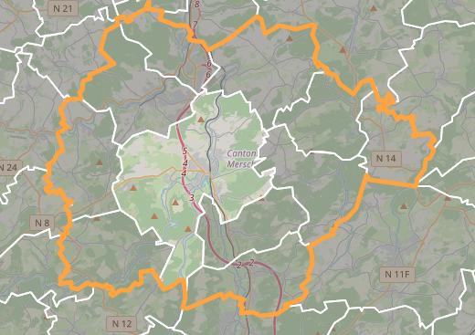

# Leaflet.drillbounds
Provides a drill down map using administrative divisions provided by [GeoBoundaries](https://github.com/wmgeolab/geoBoundaries) for [Leaflet](https://leafletjs.com/), a library for interactive maps.




## Using the plugin

Requires [mapbox/leaflet-pip](https://github.com/mapbox/leaflet-pip)

Include this plugin CSS and JS in your page along with leaflet-pip:
```html
    <script src="leaflet-pip.js"></script>
    <link rel="stylesheet" href="DrillBounds.Default.css" />
    <script src="leaflet.drillbounds.js"></script>
```

### Examples
See the included [demo](https://cardnl.github.io/Leaflet.drillbounds/demo/) for usage.

### Usage

Create a new DrillBoundaries, and add polygon feature collections to it:

```js
const drillBounds = L.drillBoundaries();

fetch('./geoBoundaries/LUX/ADM0.geojson')
  .then(resp => resp.json())
  .then(json => drillBounds.addLayerAt(0, L.geoJSON(json)))

fetch('./geoBoundaries/LUX/ADM1.geojson')
  .then(resp => resp.json())
  .then(json => drillBounds.addLayerAt(1, L.geoJSON(json)))

...Add more boundaries....
```

## Options

The boundaries can be styled by the **styles** option:

```JS
const drillBounds = L.drillBoundaries({
  styles: {
    selected: {
      fill: false,
      color: 'green',
      weight: 5
    }
  }
});
```

## Methods

### Drill methods

The only method available is: `drillUp()`.

```js
drillBounds.drillUp();
```

This drills out of the current selected boundary.

### Bindings

The bindings implemented on top of `L.FeatureGroup` events are: `drill`, `drilldown`, and `drillup`

`drill` is fired on both drill up & drill down.
```js
drillBounds.on('drill', function(evt) {
  console.log(evt.layer.feature.properties);
})
```

`drilldown` is fired when a boundary is drilled down into.
```js
drillBounds.on('drilldown', function(evt) {
  console.log(evt.layer.feature.properties);
})
```
